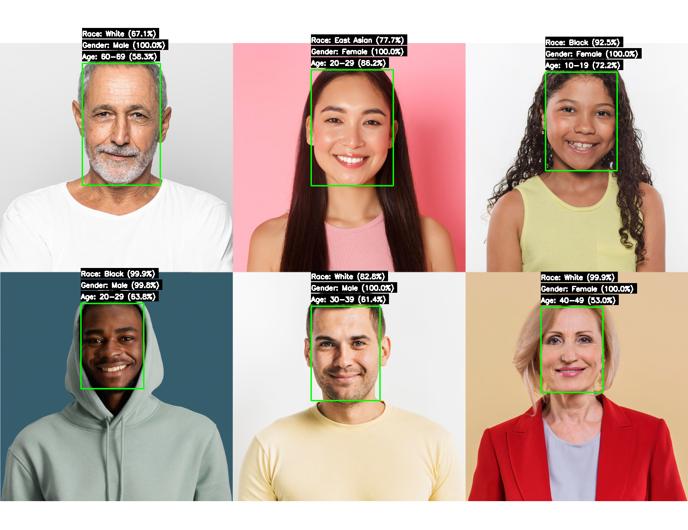

# FairFace ONNX


ONNX Runtime inference for FairFace face attribute prediction model.

<p align="center">
  
</p>

## Features

- Race prediction (7 categories)
- Gender prediction (Male/Female)
- Age prediction (9 groups)
- PyTorch and ONNX Runtime support
- Image and webcam inference

## Installation

```bash
pip install -r requirements.txt
```

## Download

| Model    | PyTorch                                                                                                               | ONNX                                                                                             |
| -------- | --------------------------------------------------------------------------------------------------------------------- | ------------------------------------------------------------------------------------------------ |
| FairFace | [fairface.pt](https://github.com/yakhyo/fairface-onnx/releases/download/weights/res34_fair_align_multi_7_20190809.pt) | [fairface.onnx](https://github.com/yakhyo/fairface-onnx/releases/download/weights/fairface.onnx) |

## Usage

### Image Inference

```bash
# PyTorch
python inference.py --source path/to/image.jpg --output result.jpg

# ONNX
python onnx_inference.py --source path/to/image.jpg --output result.jpg
```

### Webcam

```bash
python inference.py --source 0
```

### Export Model

```bash
python onnx_export.py --model weights/fairface.pt --output weights/fairface.onnx
```

## License

This project is licensed under the [MIT License](LICENSE).

Model weights are from [FairFace](https://github.com/dchen236/FairFace) and licensed under [CC BY 4.0](https://creativecommons.org/licenses/by/4.0/).
